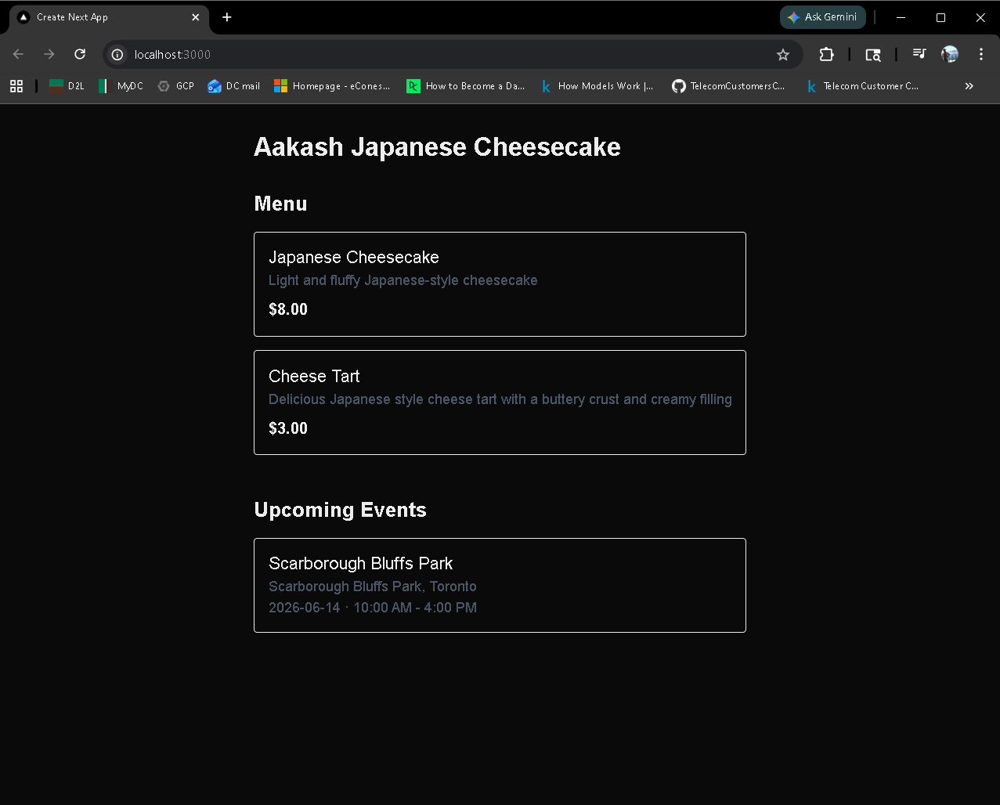
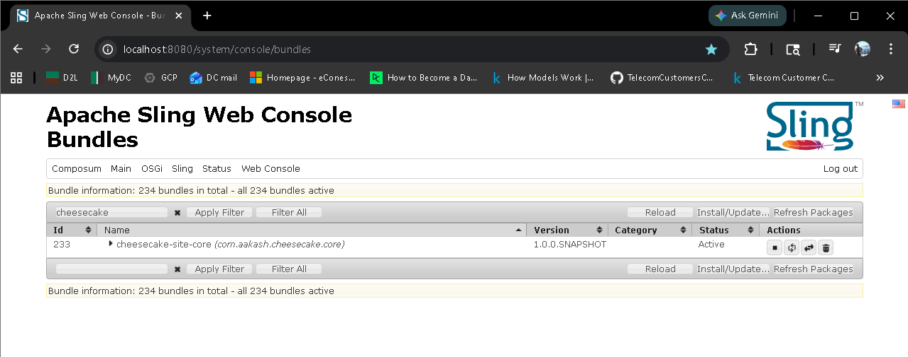
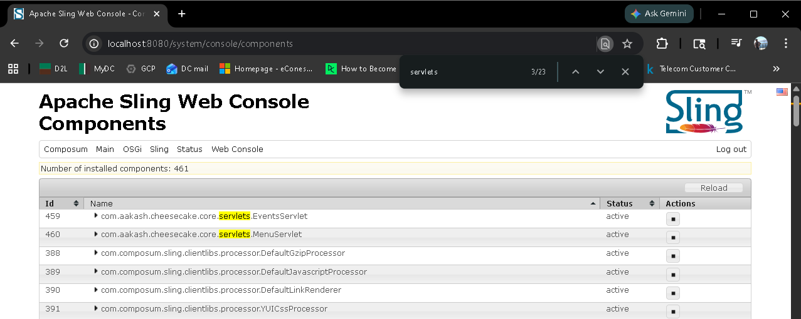
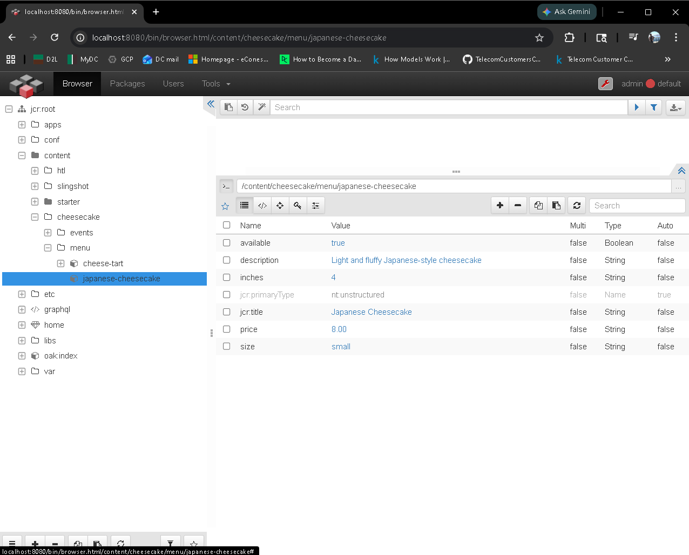
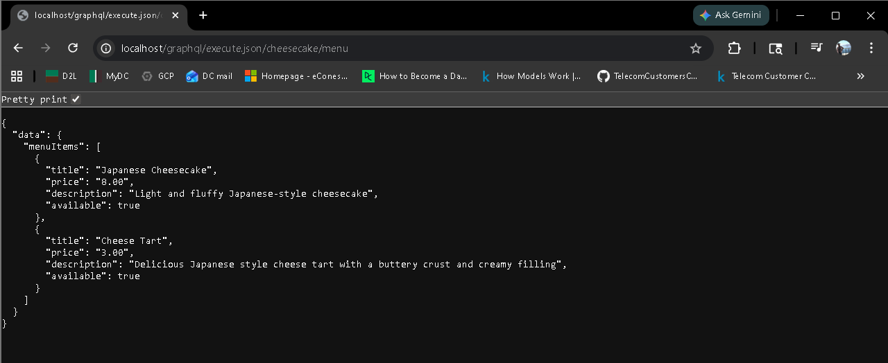
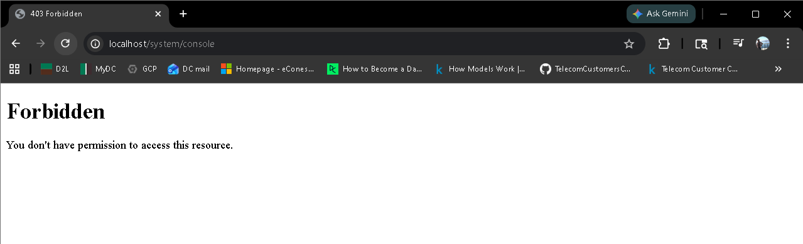

# 🍰 Cheesecake Site — AEM Headless Architecture Portfolio Project

> A production food vending website for Japanese cheesecake and cheese tarts, built on a stack that mirrors Adobe Experience Manager (AEM) headless architecture exactly — without an AEM license.

**Live business:** Selling Japanese cheesecake and cheese tarts at Ontario park events.  
**Engineering goal:** Demonstrate AEM headless architecture, Sling/OSGi development, GraphQL content delivery, and Dispatcher configuration for the Canadian AEM job market.

---

## 📐 Architecture Overview

```
┌─────────────────────────────────────────────────────────┐
│                   Browser / Client                       │
└─────────────────────┬───────────────────────────────────┘
                      │ HTTP :3000
┌─────────────────────▼───────────────────────────────────┐
│              Next.js Frontend                            │
│         Server-side fetch from Dispatcher                │
└─────────────────────┬───────────────────────────────────┘
                      │ HTTP :80
┌─────────────────────▼───────────────────────────────────┐
│           Apache httpd (Dispatcher layer)                │
│  • Reverse proxy via mod_proxy                           │
│  • Disk cache via mod_cache_disk                         │
│  • Security filtering via mod_rewrite                    │
└─────────────────────┬───────────────────────────────────┘
                      │ HTTP :8080
┌─────────────────────▼───────────────────────────────────┐
│              Apache Sling                                │
│  • OSGi bundle (MenuServlet, EventsServlet)              │
│  • JCR content nodes (menu items, events)                │
│  • GraphQL-style JSON endpoints                          │
└─────────────────────────────────────────────────────────┘
```

### AEM Headless Mapping

| This Project | AEM Equivalent |
|---|---|
| Apache Sling | AEM runtime (AEM is built on Sling) |
| JCR `nt:unstructured` nodes | AEM Content Fragments |
| Custom Sling servlet | AEM GraphQL API (`/graphql/execute.json`) |
| Apache httpd + mod_proxy/mod_cache | AEM Dispatcher |
| Next.js frontend | AEM headless frontend (same pattern) |
| FileVault content package | AEM content package deployment |

---

## 🗂️ Project Structure

```
cheesecake-site-headless/
├── cheesecake-site/               # Maven multi-module project
│   ├── pom.xml                    # Parent POM — shared deps, Sling URL
│   ├── core/                      # OSGi bundle — Java servlets
│   │   ├── pom.xml
│   │   └── src/main/java/com/aakash/cheesecake/core/
│   │       └── servlets/
│   │           ├── MenuServlet.java    # /graphql/execute.json/cheesecake/menu
│   │           └── EventsServlet.java  # /graphql/execute.json/cheesecake/events
│   └── ui.content/                # FileVault content package — JCR nodes
│       ├── pom.xml
│       └── src/main/content/jcr_root/content/cheesecake/
│           ├── menu/
│           │   ├── japanese-cheesecake/.content.xml
│           │   └── cheese-tart/.content.xml
│           └── events/
│               └── scarborough-bluffs-june/.content.xml
├── dispatcher/                    # Apache httpd Dispatcher layer
│   ├── Dockerfile
│   └── httpd.conf
├── frontend/                      # Next.js frontend
│   ├── Dockerfile
│   ├── app/
│   │   ├── page.tsx               # Home page — fetches menu + events
│   │   └── layout.tsx
│   └── .env.local                 # API_URL for local dev
├── docker-compose.yml             # Full stack orchestration
└── README.md
```

---

## 🚀 Quick Start

### Prerequisites

- Docker Desktop
- Node.js 22+
- Java 17+
- Maven 3.9+

### Run the full stack

```bash
# Clone the repo
git clone https://github.com/yourusername/cheesecake-site-headless.git
cd cheesecake-site-headless

# Start all services
docker-compose up --build
```

| Service | URL |
|---|---|
| Next.js frontend | http://localhost:3000 |
| Dispatcher | http://localhost:80 |
| Sling / Felix console | http://localhost:8080/system/console |

> Default Sling credentials: `admin` / `admin`

### Install content and bundle (first run)

```bash
# Build and deploy OSGi bundle to Sling
cd cheesecake-site
mvn clean install sling:install -pl core

# Build content package
mvn clean install -pl ui.content
```

Then upload `ui.content/target/cheesecake-site-content-1.0-SNAPSHOT.zip` via the Composum package manager at `http://localhost:8080/bin/packages.html`.

---

## 📡 API Endpoints

Both endpoints are registered via OSGi annotations and mirror AEM's persisted query URL pattern.

### Menu

```
GET /graphql/execute.json/cheesecake/menu
```

```json
{
  "data": {
    "menuItems": [
      {
        "title": "Japanese Cheesecake",
        "price": "8.00",
        "description": "Light and fluffy Japanese-style cheesecake",
        "available": true
      },
      {
        "title": "Cheese Tart",
        "price": "3.00",
        "description": "Delicious Japanese style cheese tart with a buttery crust and creamy filling",
        "available": true
      }
    ]
  }
}
```

### Events

```
GET /graphql/execute.json/cheesecake/events
```

```json
{
  "data": {
    "events": [
      {
        "title": "Scarborough Bluffs Park",
        "location": "Scarborough Bluffs Park, Toronto",
        "date": "2026-06-14",
        "hours": "10:00 AM - 4:00 PM",
        "active": true
      }
    ]
  }
}
```

---

## 🧱 JCR Content Nodes

Content is defined as XML files under `ui.content/` and deployed as a FileVault content package — the same mechanism used in AEM production deployments.

### Menu item node (`nt:unstructured`)

```xml
<jcr:root xmlns:jcr="http://www.jcp.org/jcr/1.0"
          jcr:primaryType="nt:unstructured"
          jcr:title="Japanese Cheesecake"
          description="Light and fluffy Japanese-style cheesecake"
          price="8.00"
          size="small"
          inches="4"
          available="{Boolean}true"/>
```

> In AEM this would be a **Content Fragment** backed by a **Content Fragment Model**. On plain Sling, `nt:unstructured` nodes with typed properties serve the same structural role.

### Adding a new menu item

1. Create a new folder under `ui.content/src/main/content/jcr_root/content/cheesecake/menu/`
2. Add `.content.xml` with item properties
3. Rebuild and reinstall the content package — no servlet code changes needed

```bash
mvn clean install -pl ui.content
# Upload new ZIP via Composum package manager
```

---

## ⚙️ Dispatcher Configuration

The Dispatcher layer (`dispatcher/httpd.conf`) replicates AEM Dispatcher's core responsibilities using native Apache httpd 2.4 modules.

### Module responsibilities

| Module | Role |
|---|---|
| `mod_proxy` + `mod_proxy_http` | Reverse proxy to Sling |
| `mod_cache` + `mod_cache_disk` | Disk-based JSON response caching |
| `mod_rewrite` | Security filtering |
| `mod_unixd` | Unix privilege dropping |

### Security filtering (dual-layer)

```apache
# Layer 1 — RewriteRule returns 403 immediately
RewriteRule ^/system/console(.*)$ - [F,L]
RewriteRule ^/bin/(.*)$           - [F,L]
RewriteRule ^/etc/(.*)$           - [F,L]

# Layer 2 — ProxyPass exclusion (never proxied even if RewriteRule fails)
ProxyPass /system/console !
ProxyPass /bin/           !
ProxyPass /etc/           !
```

### Cache configuration

```apache
# Cache only GraphQL endpoints
CacheEnable disk /graphql/execute.json/
CacheRoot /var/cache/apache2/proxy
CacheDefaultExpire 300       # 5 min TTL when no Cache-Control header
CacheMaxExpire 300           # 5 min ceiling regardless of backend headers
CacheIgnoreNoLastMod On      # Cache even without Last-Modified header
CacheIgnoreHeaders Set-Cookie Cookie  # Strip session data from cache
```

> In a licensed AEM environment, `mod_dispatcher.so` and `dispatcher.any` replace this configuration. The architectural role — reverse proxy, disk cache, security filter — is identical.

---

## 🔧 OSGi Servlet Registration

Servlets are registered with Sling's OSGi container via annotations — no XML descriptors required.

```java
@Component(service = Servlet.class)
@SlingServletPaths("/graphql/execute.json/cheesecake/menu")
public class MenuServlet extends SlingSafeMethodsServlet {

    @Override
    protected void doGet(SlingHttpServletRequest request,
                         SlingHttpServletResponse response)
                         throws ServletException, IOException {

        Resource menuResource = request.getResourceResolver()
                .getResource("/content/cheesecake/menu");

        if (menuResource == null) {
            response.sendError(404, "Menu content not found");
            return;
        }

        // Build JSON via Jackson — safe string escaping
        ObjectNode root = MAPPER.createObjectNode();
        // ... iterate children, read ValueMap properties
    }
}
```

**Key design decisions:**
- `SlingSafeMethodsServlet` — read-only servlet, auto-rejects POST/DELETE
- `ResourceUtil.getValueMap()` — never returns null, safe alternative to `adaptTo()`
- `ObjectMapper` — Jackson handles JSON serialisation and escaping, no StringBuilder concatenation
- Null check on `getResource()` — returns 404 cleanly if content path missing

---

## 🐳 Docker Compose

```yaml
services:
  sling:
    image: apache/sling:latest
    ports: ["8080:8080"]
    volumes:
      - sling-launcher:/opt/sling/launcher  # Persists JCR across restarts

  dispatcher:
    build: ./dispatcher
    ports: ["80:80"]
    depends_on: [sling]
    volumes:
      - dispatcher-cache:/var/cache/apache2
      - dispatcher-logs:/var/log/apache2

  frontend:
    build: ./frontend
    ports: ["3000:3000"]
    depends_on: [dispatcher]
    environment:
      - API_URL=http://dispatcher  # Container name resolves on shared network
```

All three services share `cheesecake-network` — containers communicate directly by service name. This mirrors AEM cloud topology where Dispatcher and publish instance are on the same private network.

---

## 📸 Screenshots

### 1. Frontend — full stack rendering live JCR data

> `http://localhost:3000` — Next.js renders menu cards and events fetched through the Dispatcher from Sling JCR nodes.

### 2. Felix OSGi Console — bundle active

> `http://localhost:8080/system/console/bundles` — `com.aakash.cheesecake.core` in **Active** state, confirming the OSGi bundle deployed and resolved all dependencies.

### 3. Felix OSGi Console — servlet components registered

> `http://localhost:8080/system/console/components` — search `cheesecake` — both `MenuServlet` and `EventsServlet` shown as **satisfied** Declarative Services components with their `@SlingServletPaths` properties visible.

### 4. JCR Content Browser (Composum) — content nodes

> `http://localhost:8080/bin/browser.html/content/cheesecake` — `/content/cheesecake/menu` and `/content/cheesecake/events` nodes with properties expanded, equivalent to AEM Content Fragments.

### 5. Dispatcher — cached JSON response with headers

> `http://localhost/graphql/execute.json/cheesecake/menu` via DevTools Network tab — JSON response served through the Dispatcher (port 80) with cache response headers visible.

### 6. Dispatcher — security filtering (403 on blocked path)

> `http://localhost/system/console` — Dispatcher returns **403 Forbidden**, proving the dual-layer `RewriteRule` + `ProxyPass` security filtering is active.

---

## 🎯 AEM JD Alignment

This project directly addresses the following requirements from AEM Developer roles:

| JD Requirement | How this project demonstrates it |
|---|---|
| AEM headless CMS, content fragments, APIs | JCR nodes as Content Fragment equivalent, custom GraphQL-style API |
| Apache Sling, Apache Felix, OSGi | OSGi bundle with servlet registered via DS annotations |
| AEM Dispatcher caching, routing, security | Full httpd config with mod_cache, mod_proxy, mod_rewrite |
| Next.js headless frontend collaboration | Server-side Next.js fetching from Dispatcher-cached JSON |
| JCR | Content nodes defined as XML, deployed via FileVault |
| RESTful APIs, JSON | Two JSON endpoints at AEM persisted query URL pattern |
| Git-based workflows | Conventional Commits, module-level commits per layer |
| Debugging across AEM and infrastructure | Diagnosed Docker networking, cache scoping, OSGi module dependencies |

---

## 🗺️ What Would Change in Licensed AEM

| This project | Licensed AEM equivalent |
|---|---|
| `nt:unstructured` nodes | Content Fragments with Content Fragment Models |
| Custom Sling servlet | AEM's built-in GraphQL API (auto-generated from CF Models) |
| `mod_proxy` + `mod_cache` | `mod_dispatcher.so` + `dispatcher.any` |
| Manual cache TTL | Flush agent triggered on content publish |
| `admin:admin` credentials | IMS authentication, service users |
| Local Docker | AEM as a Cloud Service (AEMaaCS) on Azure |

---

## 🏗️ Built With

- [Apache Sling](https://sling.apache.org/) — content framework
- [Apache Felix](https://felix.apache.org/) — OSGi container
- [Apache httpd 2.4](https://httpd.apache.org/) — Dispatcher layer
- [Next.js 16](https://nextjs.org/) — React frontend framework
- [Jackson](https://github.com/FasterXML/jackson) — JSON serialisation
- [FileVault](https://jackrabbit.apache.org/filevault/) — JCR content packaging
- [Docker Compose](https://docs.docker.com/compose/) — multi-container orchestration
- [Tailwind CSS](https://tailwindcss.com/) — utility-first styling

---

## 👨‍💻 Author

**Aakash** — AEM Developer candidate  
2+ years Java/Android (Accenture AEM 6.5, Zoho)  
AEM Sites Developer Professional certification in progress (AD0-E123)  
Based in Scarborough, Ontario 🇨🇦

---

*This project was built as a real production website for a food vending business while simultaneously serving as a portfolio demonstration of AEM headless architecture — without an AEM license.*